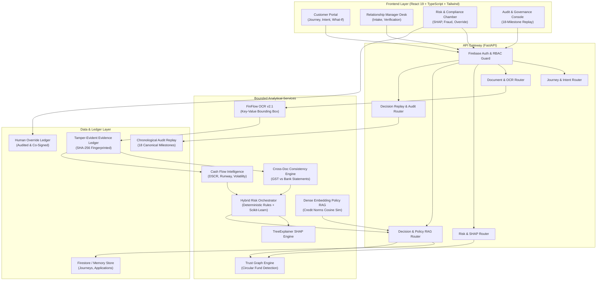

# FinFlow AI — System Architecture & Design Specification
**Version:** 2.1.0 · **Classification:** Enterprise FinTech Platform

---

## 1. Architectural Philosophy

FinFlow AI is architected around 4 core principles:
1. **Zero-Hallucination Underwriting:** No probabilistic LLM or deep model can autonomously determine financial eligibility or mutate credit policy gates.
2. **Cryptographic Proof of Evidence:** Every derived ratio (DSCR, turnover, balance) must trace directly back to an immutable, OCR-extracted bounding box with a verifiable SHA-256 document fingerprint.
3. **Four-Tier Separation of Duties (SoD):** A clear visual and programmatic hierarchy separates automated model output, independent risk review, authorized credit sanction, and independent audit inspection.
4. **Append-Only Immutability:** Financial journeys, decisions, and audit events are strictly append-only. Overrides preserve original AI recommendations and record mandatory rationale codes.

---

## 2. Component Architecture Diagram



---

## 3. The 7 Bounded Modules

### Module 1: Intent & Problem Understanding
- Ingests structured and conversational loan parameters (loan purpose, requested ticket size, desired tenor, GSTIN, PAN).
- Maps high-level intent to targeted credit products (e.g. `sme_working_capital`).

### Module 2: Journey Orchestration & State Machine
The core finite-state machine enforces deterministic lifecycle progression:

```
[INTENT_CAPTURE]
       │
       ▼
[EVIDENCE_COLLECTION] ──(Missing Docs)──► [Next Best Action: Upload]
       │
       ▼
  [VERIFICATION] ───────(Discrepancy)───► [HUMAN_REVIEW]
       │                                         ▲
       ▼                                         │
[RISK_ASSESSMENT] ──────(Adverse Signal)─────────┤
       │                                         │
       ▼                                         │
[EXPLAINABLE_DECISION] ─(Policy Violation)───────┘
       │
       ├─────────────────────────┐
       ▼                         ▼
[SANCTION_AND_DISBURSAL]    [REJECTED]
```

### Module 3: Core Financial Processing & Reconciliation
- Reconciles declared GST turnover against annualized banking credits.
- Computes Debt Service Coverage Ratio (DSCR):
  $$\text{DSCR} = \frac{\text{Net Operating Cash Flow}}{\text{Annual Debt Service Obligation}}$$
- Flags accounts with inward cheque returns $> 2$ in 6 months or variance $> 15\%$.

### Module 4: Dual Underwriting Engine & White-Box AI
- **Deterministic Hard Gates:** Evaluated first. If any hard rule fails (e.g. vintage $< 24$ months or active GST cancellation), the application is immediately rejected or escalated, regardless of ML probability.
- **Scikit-Learn Calibrated Classifier:** Predicts Probability of Default (PD) mapped to a 300–1000 FinFlow Trust Score.
- **TreeExplainer SHAP:** Computes exact marginal log-odds attributions for each financial feature, rendering positive and negative risk bars.
- **Dense Policy RAG:** Matches borrower parameters against indexed institutional credit norms using vector similarity, generating cited policy clauses.

### Module 5: Trust, Governance & Human Oversight
- **Underwriter Override Workflow:** Authorizes senior credit officers to override AI recommendations with required reason codes, justification notes, and mandatory co-signatures.
- **Separation of Duties (SoD):** Admin users have zero financial approval authority; Customer sessions cannot view internal queues; Audit officers operate in read-only inspection mode.

### Module 6: Product & Role-Aware Dashboards
- **SME Customer:** Simple, guided journey interface with What-If counterfactual slider simulation and instant digital sanction acceptance.
- **Relationship Manager:** Queue management, document verification workbench, and borrower communication.
- **Risk & Compliance:** Deep-dive credit sanction chamber, SHAP waterfalls, network risk inspection, and cross-application signals.
- **Audit & Governance:** Chronological 18-milestone decision replay with cryptographic hash verification.

### Module 7: Financial Trust Intelligence Layer (Network Graph)
- Entity graph mapping borrowers, promoters, bank accounts, and affiliated suppliers.
- Detects circular round-tripping transactions and accommodation invoices across synthetic entities.

---

## 4. Governance Tiers & Visual Separation of Duties

| Governance Tier | System Designation | Authorized Role | UI Badge Styling | Description |
|---|---|---|---|---|
| **Tier 1: Model Output** | `MODEL_OUTPUT` | Automated AI Engine | Indigo / Slate Badge | Raw algorithmic risk scoring, SHAP attributions, and preliminary recommendation. |
| **Tier 2: Independent Review** | `INDEPENDENT_REVIEW` | Risk & Compliance Officer | Amber / Warning Badge | Independent secondary scrutiny of discrepancies, fraud signals, or policy exceptions. |
| **Tier 3: Authorized Decision** | `AUTHORIZED_DECISION` | Credit Approver | Emerald / Success Badge | Final legal and financial sanction authority binding the financial institution. |
| **Tier 4: Independent Audit** | `INDEPENDENT_AUDIT` | Internal / Regulatory Auditor | Purple / Neutral Badge | Read-only inspection of immutable chronological Decision Replay logs. |

---

## 5. Security & Cryptographic Verifiability

- **SHA-256 Document Fingerprints:** Every uploaded PDF is hashed at the edge before storage; extracted evidence stores the `sha256_source_hash` to detect subsequent tampering.
- **Immutable Ledger Pattern:** Records written to `evidence_ledger`, `decisions`, `overrides`, and `audit_logs` are strictly append-only.
- **Server-Side Token Verification:** Firebase ID tokens or cryptographic demo tokens are verified on every incoming request.
