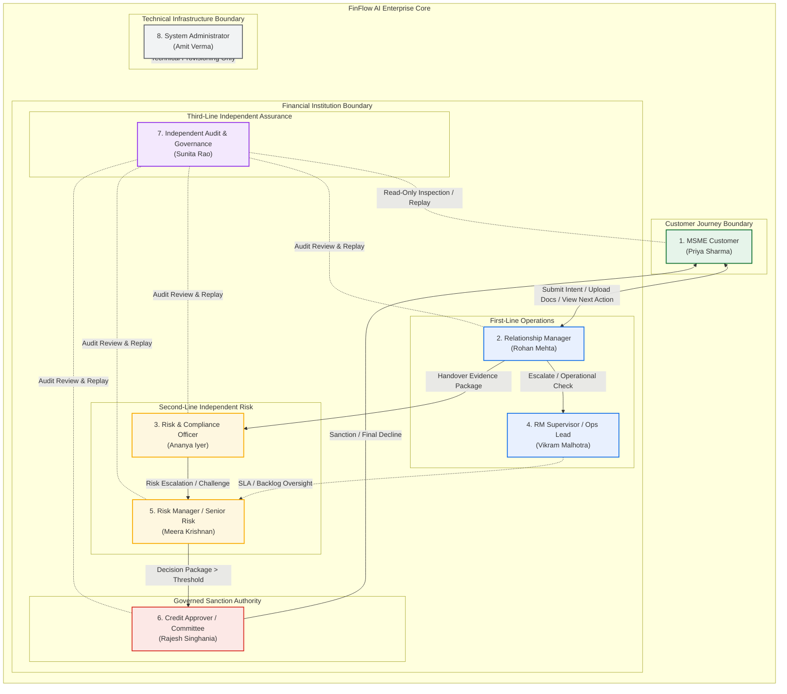
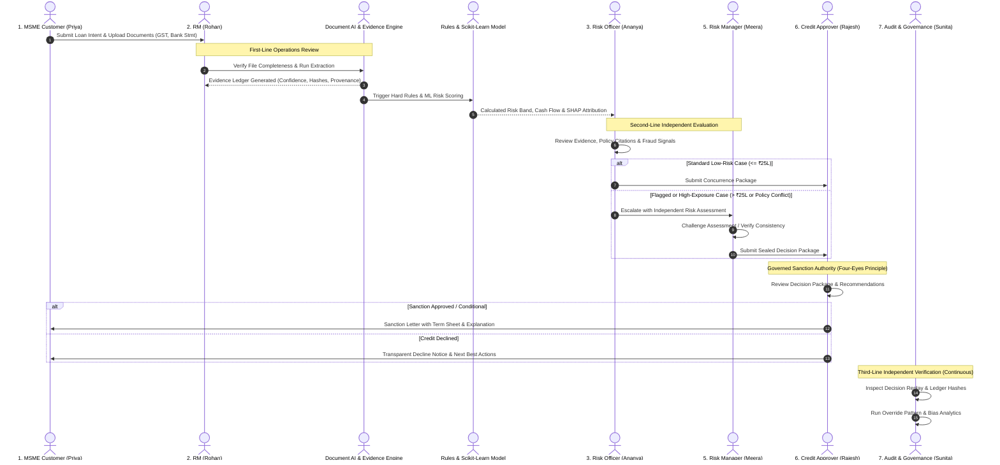
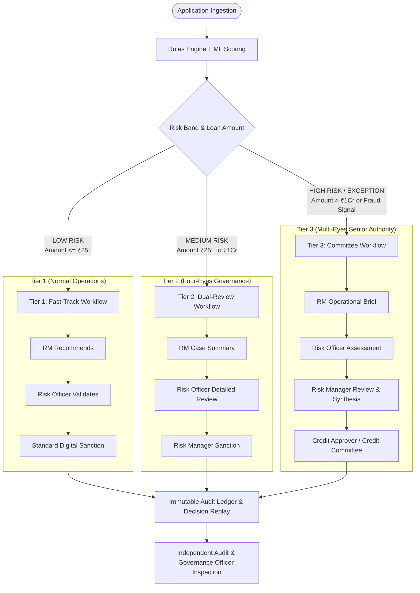

# FinFlow AI — Enterprise RBAC & Separation of Duties Specification

> **Document Status:** Architectural Baseline & Implementation Blueprint  
> **Version:** 3.0.0  
> **Last Updated:** October 2026  
> **Target Audience:** Engineering, Risk Officers, Credit Committee, Security Auditors, Compliance  

---

## 1. Executive Summary & Core Philosophy

### 1.1 The Transparency Principle: "Not Everybody Can Do Everything"
In high-stakes financial underwriting, artificial intelligence must never operate in a vacuum, nor should any single human actor possess unchecked authority. Conventional lending platforms fail in trust because they introduce "Super Admin" accounts capable of silently modifying records, backdating approvals, or overriding ML risk scores without institutional scrutiny.

FinFlow AI establishes a **Separation of Duties (SoD)** architecture rooted in five immutable pillars:

```text
       AI
       │ (Generates Feature Attributions, Scikit-Learn Probability, Consistency Checks)
       ▼
  RECOMMENDATION
       │ (Deterministic Policy Rules + Confidence Bounding)
       ▼
     HUMAN
       │ (Governed by Delegated Authority Thresholds & Four-Eyes Principle)
       ▼
    DECISION
       │ (Dual-Signed, Reason-Captured, Cryptographically Snapshotted)
       ▼
     AUDIT
       │ (Independent Read-Only Inspection via Decision Replay & Immutable Ledger)
       ▼
    FEEDBACK
       │ (Drift Detection & Retraining Dataset Curation)
       ▼
AI / PROCESS IMPROVEMENT
```

> **The FinFlow AI Golden Principle:**  
> *AI recommends. Humans govern. Evidence supports. Audit verifies. Feedback improves.*

### 1.2 Eliminating the "Super Admin" Antipattern
Traditional enterprise software bundles technical administration and business power into a single `SUPER_ADMIN` or `ADMIN` role. **In FinFlow AI, this antipattern is strictly forbidden.**
- **System Administrator** is exclusively a **Technical Custodian**: manages API keys, network infrastructure, database connections, and user identity lifecycle.
- **System Administrator has ZERO financial authority**: cannot view raw customer financial statements, cannot approve loans, cannot override risk band calculations, cannot modify credit policies, and cannot touch or delete audit records.

---

## 2. Complete 7+1 FinFlow AI Role Taxonomy

FinFlow AI defines **7 business personas** organized across two operational boundaries (Customer-Facing vs. Institutional), plus **1 purely technical System Administrator**.



---

### Detailed Persona Profiles & Authority Limits

#### Role 1: MSME Customer
- **Persona:** Priya Sharma (Founder & Managing Director, Sharma Textiles Pvt. Ltd.)
- **Scope:** Own application, submitted evidence, and customer-facing journey.
- **Can:**
  - Create new credit application and state financing intent.
  - Upload compliance & financial documents (GST, ITR, Bank Statements, Udyam Aadhaar).
  - View own extracted evidence items and verification status.
  - Correct and re-submit information requested by the bank.
  - View live journey stage, next best action, and loan status.
  - View plain-language, explainable decision narrative.
  - Accept loan sanction letters and review final terms.
- **Cannot:**
  - View other applicants' data or cross-entity fraud signals.
  - Modify ML risk scores or calculated cash-flow analytics.
  - Tamper with or edit evidence after formal submission.
  - View internal risk notes, officer chat, or raw SHAP weights.
  - Approve or decline credit facilities.
- **Customer Transparency Guarantee:**
  Every customer view displays a 5-step transparent progress chain:
  $$\text{Current Stage} \longrightarrow \text{What Has Been Verified} \longrightarrow \text{What Is Missing} \longrightarrow \text{Why Review Is Required} \longrightarrow \text{What Happens Next}$$

---

#### Role 2: Relationship Manager (RM) / Loan Officer
- **Persona:** Rohan Mehta (Commercial SME Lending Unit)
- **Scope:** First-line operational owner for assigned pipeline cases.
- **Can:**
  - View and triage assigned customer applications.
  - Review applicant profile, extracted financial data, and OCR confidence.
  - Issue formal requests for missing or illegible documents.
  - Add operational case notes and applicant interview context.
  - View AI risk summaries and explainable decision suggestions.
  - Recommend approval, condition, or escalation to Risk.
  - Initiate human review workflow on behalf of applicant.
- **Cannot:**
  - Modify extracted financial data silently without audit logs.
  - Alter ML model probabilities, SHAP values, or policy rules.
  - Change credit risk cutoffs or credit policy parameters.
  - Delete audit logs or overwrite case activity history.
  - Approve exceptions or final credit limits unilaterally (no single-actor sanction).

---

#### Role 3: Risk & Compliance Officer
- **Persona:** Ananya Iyer (Credit Risk & Fraud Control Specialist)
- **Scope:** Second-line independent evaluation of creditworthiness, policy, and fraud.
- **Can:**
  - Inspect full Evidence Ledger with OCR confidence and bounding boxes.
  - Review Scikit-Learn risk score and SHAP waterfall attributions.
  - Review automated cross-document consistency checks (GST vs. Bank turnover).
  - Inspect cross-application relationship graphs and shared identifier flags (PAN, GSTIN, Phone, Bank A/C).
  - Review retrieved institutional lending policy clauses via Policy RAG.
  - Request additional collateral, co-signers, or specialized audits.
  - Concur with AI decision or formulate an independent risk recommendation.
  - Escalate flagged/high-risk cases to the Risk Manager.
- **Cannot:**
  - Edit raw customer documents or mutate verified evidence.
  - Manually rewrite ML outputs or model version tags.
  - Directly alter regulatory credit policy documents.
  - Delete audit events or decision snapshots.
  - Unilaterally sanction high-value loans beyond delegated authority.

---

#### Role 4: RM Supervisor / Credit Operations Manager (NEW)
- **Persona:** Vikram Malhotra (Head of Credit Operations & RM Supervision)
- **Scope:** First-line operational quality, pipeline velocity, SLA enforcement, and RM conduct.
- **Why this role is essential:** RMs handle large queues; without supervision, document requests can stall, cases breach SLAs, or unwarranted escalations occur.
- **Can:**
  - View all active RMs, assigned queues, and team turnaround times.
  - Reassign cases between RMs based on workload and specializations.
  - Review RM case notes, document request frequency, and pipeline velocity.
  - Detect and mitigate operational bottlenecks (e.g. repeated document rejections).
  - Approve operational exceptions (e.g. 7-day document extension, fast-track triage).
  - Escalate delayed or complex operational cases directly to the Risk Manager.
- **Cannot:**
  - Overwrite risk model calculations or alter risk classifications.
  - Edit or fabricate customer evidence.
  - Modify compliance rules or risk policies.
  - Secretly sanction loans or bypass Risk & Compliance controls.
  - Delete audit events.

---

#### Role 5: Risk Manager / Senior Credit Risk Officer (NEW)
- **Persona:** Meera Krishnan (Senior Vice President, Credit Risk Oversight)
- **Scope:** Second-line supervisory risk management, model challenge, and policy exception review.
- **Why this role is essential:** When a Risk Officer flags an application as "High Risk — Escalate" or recommends an override, a senior credit risk authority must independently review the rationale, ensure consistency across analysts, and determine if Credit Approver sign-off is required.
- **Can:**
  - Review and challenge Risk Officer assessments and recommendations.
  - Inspect high-risk cases, fraud signals, and identity discrepancies.
  - Require supplemental evidence or third-party bank verification.
  - Review and monitor analyst override patterns for consistency.
  - Approve credit evaluations within defined delegated limits (up to ₹1 Crore).
  - Assemble the complete **Decision Package** and escalate to the Credit Approver/Committee.
- **Cannot:**
  - Alter the underlying evidence ledger or recalculate source figures.
  - Delete audit trails or suppress historical risk assessments.
  - Override decisions without recording a mandatory, auditable justification.

---

#### Role 6: Credit Approver / Credit Committee (NEW)
- **Persona:** Rajesh Singhania (Chief Credit Officer / Credit Committee Chair)
- **Scope:** Final institutional sanction authority for loans crossing risk and monetary limits.
- **Why this role is essential:** Ensures true **Four-Eyes and Multi-Eyes governance**. Operational officers and risk analysts recommend; Credit Approvers decide.
- **Can:**
  - Review complete, sealed Decision Packages (Customer Profile + Evidence Ledger + ML Score + SHAP Breakdown + RM Recommendation + Risk Manager Evaluation + Policy Citations).
  - Exercise sanction authority based on delegated limits:
    - Approve facility with standard or enhanced terms.
    - Conditionally approve with stipulations (e.g., personal guarantee, increased collateral).
    - Decline credit application.
    - Return package for specific clarification or verification.
  - Convene Credit Committee for high-exposure cases (> ₹1 Crore).
- **Cannot:**
  - Modify underlying customer documents or evidence items.
  - Manually rewrite ML risk scores or model parameters.
  - Suppress audit events or modify past decision records.

---

#### Role 7: Independent Audit & Governance Officer (NEW)
- **Persona:** Sunita Rao (Director of Internal Audit & Algorithmic Governance)
- **Scope:** Third-line independent assurance across the entire lifecycle. Completely isolated from the RM and Risk reporting lines.
- **Why this role is essential:** Answers the fundamental question: *"Who checks that the people using the system are themselves behaving correctly?"*
- **Role Characteristics:** **Read-heavy, write-restricted**.
- **Can:**
  - Inspect any historical or active case across the portfolio.
  - Execute **Decision Replay**: step-by-step reconstruction of every event in chronological order.
  - Verify Evidence Ledger cryptographic hashes and OCR provenance.
  - Inspect who changed what, when, why, and under which policy/model version.
  - Monitor human override patterns across RMs, Risk Officers, and Approvers to detect bias, anomalies, or suspicious approvals.
  - Open formal **Audit Findings** and request internal compliance investigations.
- **Cannot:**
  - Approve or decline loan applications.
  - Modify customer records, financial figures, or risk scores.
  - Modify policy files or risk engine thresholds.
  - Delete or tamper with audit records.

---

#### Role 8: System Administrator (Technical Custodian)
- **Persona:** Amit Verma (Lead Cloud Infrastructure & DevOps Engineer)
- **Scope:** Platform health, user provisioning, API security, and integration monitoring.
- **Can:**
  - Manage user accounts, role bindings (claims), and password resets.
  - Configure external API credentials (GSTN, Account Aggregator, Firebase, OCR services).
  - Monitor server uptime, error logs, and performance metrics.
  - Manage database backups and disaster recovery protocols.
- **Strict Invariants (Cannot):**
  - **CANNOT APPROVE OR DECLINE LOANS.**
  - **CANNOT ALTER CREDIT RISK SCORES OR POLICY RULES.**
  - **CANNOT ACCESS RAW FINANCIAL STATEMENTS WITHOUT SECURITY LOGGING.**
  - **CANNOT ALTER OR PURGE AUDIT LOGS.**

---

## 3. Canonical RBAC Permission Matrix

The following matrix formally defines system capabilities across all 8 personas.

| Capability / Action | MSME Customer | Relationship Manager (RM) | Risk & Compliance Officer | RM Supervisor | Risk Manager | Credit Approver | Audit & Governance | System Administrator |
|---|:---:|:---:|:---:|:---:|:---:|:---:|:---:|:---:|
| **Create Application** | ✓ | ✓ | — | — | — | — | — | — |
| **Upload Documents** | ✓ | ✓ | — | — | — | — | — | — |
| **View Own Case** | ✓ | — | — | — | — | — | — | — |
| **View Assigned Cases** | — | ✓ | ✓ | ✓ (All Team) | ✓ (All Dept) | ✓ (Assigned) | ✓ (All Portfolio) | — |
| **Request Documents** | — | ✓ | ✓ | ✓ | ✓ | — | — | — |
| **View Evidence Ledger** | Own Extracted | ✓ | ✓ | ✓ | ✓ | ✓ | ✓ | — |
| **Modify Evidence** | — | — | — | — | — | — | — | — |
| **Review Risk & SHAP** | — | Summary | ✓ Full | Summary | ✓ Full | ✓ Full | ✓ Full | — |
| **Change Model Output** | — | — | — | — | — | — | — | — |
| **Add Recommendation** | — | ✓ (RM Rec) | ✓ (Risk Rec) | ✓ (Ops Rec) | ✓ (Risk Rec) | — | — | — |
| **Approve Ops Exception** | — | — | — | ✓ | — | — | — | — |
| **Approve Credit Exception** | — | — | — | — | Recommend | ✓ | — | — |
| **Final Credit Decision** | — | — | — | — | Up to ₹1Cr | ✓ Unlimited* | — | — |
| **Override AI Decision** | — | Recommend | Recommend | — | Recommend | ✓* (Reason Req.) | — | — |
| **Reassign Case** | — | — | — | ✓ | ✓ | — | — | — |
| **View Audit Logs** | Own Summary | Limited | ✓ Full | ✓ Team | ✓ Dept | ✓ Case | ✓ Complete | Technical Only |
| **Modify Audit Logs** | **NEVER** | **NEVER** | **NEVER** | **NEVER** | **NEVER** | **NEVER** | **NEVER** | **NEVER** |
| **Decision Replay** | Own Summary | ✓ Case | ✓ Case | ✓ Team | ✓ Case | ✓ Case | ✓ Complete | — |
| **Policy Modification** | — | — | — | — | Controlled | Controlled | — | — |
| **Manage Users & Auth** | — | — | — | — | — | — | — | ✓ |
| **Open Audit Finding** | — | — | — | — | — | — | ✓ | — |

$$\begin{aligned}
\text{Legend:}\quad &✓ = \text{Full authorized capability} \\
&— = \text{Strictly prohibited by policy & security rules} \\
&✓^* = \text{Allowed only within configured delegated limit; mandatory reason code, rationale \& audit event} \\
&\text{Controlled} = \text{Requires dual-custody governance workflow; cannot be edited directly by one person} \\
&\text{NEVER} = \text{Enforced as an immutable system-level invariant in code and database rules}
\end{aligned}$$

---

## 4. The Honest FinFlow Decision Loop

FinFlow AI ensures that decisions are never a "black box" and never subject to hidden human alterations. Every handoff produces an immutable audit record.



### What Makes This Loop "Honest"?
When an internal audit or regulator asks: **"Why was application `APP-8291` approved despite high debt utilization?"**, FinFlow AI answers with deterministic proof:

```json
{
  "who": "Rajesh Singhania (CREDIT_APPROVER, UID: usr_rajesh_006)",
  "when": "2026-10-03T16:42:19Z",
  "what": "CONDITIONAL_APPROVAL",
  "sanctioned_amount_inr": 4500000.0,
  "interest_rate_pct": 11.25,
  "why": {
    "reason_code": "RC_STRONG_COUNTERPARTY_TIE_UP",
    "rationale": "High utilization offset by verified Tier-1 PSU receivables in GSTR-1 and unencumbered industrial property pledge.",
    "stipulations": ["Personal guarantee of Managing Director", "Escrow on PSU receivables"]
  },
  "evidence_ids": ["ev_gst_091", "ev_bank_481", "ev_prop_012"],
  "policy_version": "POL-SME-WC-2026.4",
  "ai_risk_output": {
    "original_score": 0.68,
    "risk_band": "MEDIUM_HIGH_RISK",
    "model_version": "scikit-learn-sme-v3.0",
    "top_risk_factor": "DEBT_SERVICE_COVERAGE_BELOW_BENCHMARK"
  },
  "prior_recommendations": [
    {"role": "RM", "officer": "Rohan Mehta", "recommendation": "APPROVE", "notes": "Strong client relationship for 4 years."},
    {"role": "RISK_OFFICER", "officer": "Ananya Iyer", "recommendation": "ESCALATE", "notes": "Utilization spiked past 85% in Q3."},
    {"role": "RISK_MANAGER", "officer": "Meera Krishnan", "recommendation": "CONDITIONAL_APPROVAL", "notes": "Approved for Approver review with PSU escrow stipulation."}
  ],
  "audit_trail_integrity": {
    "event_count": 18,
    "all_hashes_verified": true,
    "replay_reproducible": true
  }
}
```

---

## 5. Risk-Based Four-Eyes Principle & Delegated Authority

FinFlow AI avoids bureaucratic gridlock by implementing **Dynamic Delegated Authority Thresholds**. Straightforward, low-risk micro-loans move quickly, while high-value exceptions require multi-tier validation.



### Delegated Authority Matrix (Configurable in Database)

| Tier | Exposure Bracket (INR) | Risk Classification | Required Signers (Four-Eyes Chain) | Decision Authority |
|---|---|---|---|---|
| **Tier 1: Standard** | $\le \text{₹25,00,000}$ | LOW_RISK | RM $\rightarrow$ Risk Officer | Risk Officer Concurrence |
| **Tier 2: Core SME** | $\text{₹25,00,001} - \text{₹1,00,00,000}$ | MEDIUM_RISK | RM $\rightarrow$ Risk Officer $\rightarrow$ Risk Manager | Risk Manager Sanction |
| **Tier 3: High Exposure** | $\text{₹1,00,00,001} - \text{₹5,00,00,000}$ | ANY / HIGH_RISK | RM $\rightarrow$ Risk Officer $\rightarrow$ Risk Manager $\rightarrow$ Credit Approver | Credit Approver Sanction |
| **Tier 4: Exceptional / High Severity** | $> \text{₹5,00,00,000}$ OR Severe Fraud Signal | ANY | RM $\rightarrow$ Risk Officer $\rightarrow$ Risk Manager $\rightarrow$ Credit Committee (Dual Sanction) | Credit Committee (Chair + 2 Members) |

> **Configuration Note:** These financial thresholds are loaded dynamically from the `institution_policy/delegated_authority` collection rather than hardcoded in the codebase, enabling institutional risk policies to adjust without deployment downtime.

---

## 6. Database Architecture & Schema Updates (Firestore)

To support this 7+1 structure without loopholes, the underlying Firestore schema is enhanced across 6 collections:

### 6.1 `users` Collection Schema
```typescript
interface UserDocument {
  userId: string;                     // Firebase Auth UID
  email: string;                      // Corporate / business email
  name: string;                       // Full display name
  role:                               // Canonical 8-role enum
    | "CUSTOMER"
    | "RM"
    | "RISK_OFFICER"
    | "RM_SUPERVISOR"
    | "RISK_MANAGER"
    | "CREDIT_APPROVER"
    | "AUDIT_OFFICER"
    | "SYS_ADMIN";
  businessId?: string;                // Populated for CUSTOMER
  teamId?: string;                    // Operational cluster (for RM and RM_SUPERVISOR)
  supervisorId?: string;              // UID of direct supervisor
  delegatedApprovalLimitInr: number;  // Max sanction authority in INR (0 for Customer/RM/Audit/Admin)
  isActive: boolean;                  // Account status flag
  mfaEnabled: boolean;                // Multi-Factor Authentication enforcement
  createdAt: string;                  // ISO-8601 UTC
  updatedAt: string;                  // ISO-8601 UTC
}
```

### 6.2 `application_reviews` Collection Schema (Multi-Tier Governance)
Replacing single-shot reviews with an auditable, multi-tier review chain:
```typescript
interface ApplicationReviewDocument {
  reviewId: string;                   // Document key: "rev_" + UUID
  applicationId: string;              // Parent application reference
  journeyId: string;                  // Active journey reference
  stage: "RM_REVIEW" | "RISK_REVIEW" | "RISK_MANAGER_REVIEW" | "CREDIT_APPROVER_REVIEW" | "COMPLETED";
  tier: "TIER_1" | "TIER_2" | "TIER_3" | "TIER_4";
  
  // Original immutable AI baseline
  aiBaseline: {
    decisionId: string;
    modelScore: number;
    riskBand: "LOW_RISK" | "MEDIUM_RISK" | "HIGH_RISK";
    recommendedOutcome: "APPROVED" | "CONDITIONAL_APPROVAL" | "NEEDS_REVIEW" | "REJECTED";
    modelVersion: string;
    computedAt: string;
  };

  // Chronological human signing chain (Four-Eyes records)
  signingChain: Array<{
    step: "RM_RECOMMENDATION" | "RISK_ASSESSMENT" | "SUPERVISORY_CHALLENGE" | "FINAL_SANCTION";
    officerId: string;
    officerName: string;
    officerRole: UserRole;
    action: "RECOMMEND_APPROVAL" | "RECOMMEND_DECLINE" | "ESCALATE" | "REQUEST_INFO" | "APPROVE" | "DECLINE";
    reasonCode: string;
    rationaleNotes: string;
    stipulations?: string[];
    approvedAmountInr?: number;
    interestRatePct?: number;
    signedAt: string;
  }>;

  isCompleted: boolean;
  finalOutcome?: "APPROVED" | "CONDITIONAL_APPROVAL" | "DECLINED";
  finalApproverId?: string;
  finalApprovedAt?: string;
}
```

### 6.3 `audit_findings` Collection (Third-Line Independent Assurance)
Created exclusively by the Independent Audit & Governance Officer:
```typescript
interface AuditFindingDocument {
  findingId: string;                  // "fnd_" + UUID
  applicationId: string;              // Case under audit
  journeyId: string;
  auditOfficerId: string;             // UID of Sunita Rao
  findingType: 
    | "OVERRIDE_ANOMALY"             // Human override inconsistent with evidence
    | "SLA_BREACH"                   // Case delayed beyond statutory time
    | "POLICY_NON_COMPLIANCE"        // Decision contradicted lending policy
    | "EVIDENCE_INTEGRITY_MISMATCH"  // Hash inconsistency or missing doc
    | "BIAS_FLAG";                   // Unusual pattern detected across demographic/sector
  severity: "LOW" | "MEDIUM" | "HIGH" | "CRITICAL";
  title: string;
  narrativeExplanation: string;
  referencedEventIds: string[];      // Audit log IDs supporting the finding
  status: "OPEN" | "UNDER_INVESTIGATION" | "RESOLVED" | "CLOSED";
  targetDepartment: "FIRST_LINE_OPERATIONS" | "SECOND_LINE_RISK" | "ALGORITHMIC_MODELING";
  createdAt: string;
  updatedAt: string;
}
```

### 6.4 `delegated_authority_rules` Collection
Dynamic institutional risk governance:
```typescript
interface DelegatedAuthorityRule {
  ruleId: string;
  tierName: string;
  maxAmountInr: number;
  allowedRiskBands: string[];
  requiresFraudClearance: boolean;
  authorizedRolesToSanction: UserRole[];
  coSignRequired: boolean;
  coSignRole?: UserRole;
  effectiveFrom: string;
  version: string;
}
```

---

## 7. End-to-End Firestore Security Rules (`firestore.rules`)

The following rules enforce the 7+1 model at the database level. Direct modifications to audit logs, evidence, and decision snapshots are blocked unconditionally.

```javascript
rules_version = '2';

service cloud.firestore {
  match /databases/{database}/documents {

    // =========================================================================
    // 1. RBAC HELPER FUNCTIONS
    // =========================================================================

    function isAuthenticated() {
      return request.auth != null && request.auth.uid != null;
    }

    function isUser(userId) {
      return isAuthenticated() && request.auth.uid == userId;
    }

    // Role extraction strictly from cryptographically verified claims
    function getRole() {
      return request.auth.token.role != null ? request.auth.token.role : 'CUSTOMER';
    }

    function hasRole(role) {
      return isAuthenticated() && getRole() == role;
    }

    // Role-specific testers
    function isCustomer()       { return hasRole('CUSTOMER'); }
    function isRM()             { return hasRole('RM'); }
    function isRiskOfficer()    { return hasRole('RISK_OFFICER'); }
    function isRMSupervisor()   { return hasRole('RM_SUPERVISOR'); }
    function isRiskManager()    { return hasRole('RISK_MANAGER'); }
    function isCreditApprover() { return hasRole('CREDIT_APPROVER'); }
    function isAuditOfficer()   { return hasRole('AUDIT_OFFICER'); }
    function isSysAdmin()       { return hasRole('SYS_ADMIN'); }

    // Group-level checks
    function isFirstLineOps() {
      return isRM() || isRMSupervisor();
    }

    function isSecondLineRisk() {
      return isRiskOfficer() || isRiskManager();
    }

    function isSanctionAuthority() {
      return isRiskManager() || isCreditApprover();
    }

    function isInstitutionalStaff() {
      return isFirstLineOps() || isSecondLineRisk() || isSanctionAuthority() || isAuditOfficer();
    }

    // Ownership validation
    function isApplicationOwner(applicationId) {
      return isAuthenticated() && (
        exists(/databases/$(database)/documents/applications/$(applicationId)) &&
        get(/databases/$(database)/documents/applications/$(applicationId)).data.userId == request.auth.uid
      );
    }

    function notChanging(field) {
      return !(field in request.resource.data) ||
             (field in resource.data && request.resource.data[field] == resource.data[field]);
    }

    // =========================================================================
    // 2. USERS & PROFILES
    // =========================================================================
    match /users/{userId} {
      allow read: if isUser(userId) || isInstitutionalStaff() || isSysAdmin();
      // Public signup restricted strictly to CUSTOMER role
      allow create: if isUser(userId) && request.resource.data.role == 'CUSTOMER';
      // Only SysAdmin can assign or change institutional roles
      allow update: if (isUser(userId) && notChanging('role') && notChanging('userId') && notChanging('delegatedApprovalLimitInr')) || isSysAdmin();
      // Users are never hard-deleted; accounts are soft-disabled
      allow delete: if false;
    }

    // =========================================================================
    // 3. APPLICATIONS & JOURNEYS
    // =========================================================================
    match /applications/{applicationId} {
      allow read: if isApplicationOwner(applicationId) || isInstitutionalStaff();
      allow create: if (isAuthenticated() && request.resource.data.userId == request.auth.uid) || isFirstLineOps();
      allow update: if (isApplicationOwner(applicationId) && notChanging('applicationId') && notChanging('userId')) || isInstitutionalStaff();
      // Prevent accidental or malicious application deletion
      allow delete: if false;
    }

    match /journeys/{journeyId} {
      allow read: if (isAuthenticated() && resource.data.applicant_id == request.auth.uid) || isInstitutionalStaff();
      allow create: if isAuthenticated() && (request.resource.data.applicant_id == request.auth.uid || isFirstLineOps());
      allow update: if isInstitutionalStaff() || (isAuthenticated() && resource.data.applicant_id == request.auth.uid && notChanging('journey_id'));
      allow delete: if false;
    }

    // =========================================================================
    // 4. DOCUMENTS & EVIDENCE ITEMS — EVIDENCE LEDGER IMMUTABILITY
    // =========================================================================
    match /documents/{documentId} {
      allow read: if isApplicationOwner(resource.data.applicationId) || isInstitutionalStaff();
      allow create: if isApplicationOwner(request.resource.data.applicationId) || isFirstLineOps();
      // Documents cannot have their fileHash or storagePath modified after upload
      allow update: if isInstitutionalStaff() && notChanging('fileHash') && notChanging('storagePath');
      allow delete: if false;
    }

    match /evidence_items/{evidenceId} {
      allow read: if isApplicationOwner(resource.data.applicationId) || isInstitutionalStaff();
      // Created only by backend extraction services or institutional review
      allow create: if isInstitutionalStaff();
      // Extracted evidence items are immutable point-in-time facts
      allow update: if false;
      allow delete: if false;
    }

    // =========================================================================
    // 5. RISK ASSESSMENTS & DECISIONS — IMMUTABLE SNAPSHOTS
    // =========================================================================
    match /risk_assessments/{riskId} {
      // Customers cannot read raw risk assessments directly (must use sanitized journey endpoint)
      allow read: if isInstitutionalStaff();
      allow create: if isSecondLineRisk() || isSanctionAuthority();
      allow update: if false; // Snapshots cannot be changed
      allow delete: if false;
    }

    match /decisions/{decisionId} {
      allow read: if isApplicationOwner(resource.data.applicationId) || isInstitutionalStaff();
      allow create: if isSanctionAuthority();
      allow update: if false; // Final decisions are immutable
      allow delete: if false;
    }

    // =========================================================================
    // 6. HUMAN REVIEWS & APPLICATION REVIEWS (FOUR-EYES GOVERNANCE)
    // =========================================================================
    match /application_reviews/{reviewId} {
      allow read: if isInstitutionalStaff();
      allow create: if isFirstLineOps() || isSecondLineRisk();
      // Only authorized signers can append their signature; cannot rewrite prior signers
      allow update: if isInstitutionalStaff() && notChanging('aiBaseline') && notChanging('reviewId');
      allow delete: if false;
    }

    match /human_reviews/{reviewId} {
      allow read: if isInstitutionalStaff();
      allow create: if isInstitutionalStaff() && request.resource.data.reviewerId == request.auth.uid;
      allow update: if false; // Individual review events are append-only
      allow delete: if false;
    }

    // =========================================================================
    // 7. AUDIT LOGS — STRICTLY APPEND-ONLY (TAMPER-PROOF LEDGER)
    // =========================================================================
    match /audit_logs/{auditId} {
      allow read: if isAuditOfficer() || isSecondLineRisk() || isSanctionAuthority() || isFirstLineOps();
      allow create: if isAuthenticated();
      // Zero tolerance: Nobody can edit or delete an audit event.
      allow update: if false;
      allow delete: if false;
    }

    // =========================================================================
    // 8. AUDIT FINDINGS (THIRD-LINE ASSURANCE)
    // =========================================================================
    match /audit_findings/{findingId} {
      allow read: if isInstitutionalStaff();
      // Only the Independent Audit Officer can open findings
      allow create: if isAuditOfficer() && request.resource.data.auditOfficerId == request.auth.uid;
      allow update: if isAuditOfficer() || isSanctionAuthority();
      allow delete: if false;
    }

    // =========================================================================
    // 9. POLICIES & DELEGATED RULES
    // =========================================================================
    match /policy_documents/{policyId} {
      allow read: if isAuthenticated();
      // Policy changes require Senior Risk Manager or Credit Committee approval
      allow write: if isRiskManager() || isCreditApprover();
    }

    match /delegated_authority_rules/{ruleId} {
      allow read: if isInstitutionalStaff();
      allow write: if isCreditApprover();
    }

    // =========================================================================
    // 10. FRAUD & TRUST GRAPH
    // =========================================================================
    match /fraud_signals/{signalId} {
      allow read: if isInstitutionalStaff();
      allow create: if isSecondLineRisk();
      allow update: if false;
      allow delete: if false;
    }

    match /trust_graph_nodes/{nodeId} {
      allow read: if isInstitutionalStaff();
      allow write: if isSecondLineRisk();
    }

    match /trust_graph_edges/{edgeId} {
      allow read: if isInstitutionalStaff();
      allow write: if isSecondLineRisk();
    }
  }
}
```

---

## 8. Backend Implementation Architecture (FastAPI)

### 8.1 Python Role Enum (`backend/auth/roles.py`)
```python
from enum import Enum

class UserRole(str, Enum):
    # Customer
    CUSTOMER = "CUSTOMER"
    
    # First-Line Operations
    RM = "RM"
    RM_SUPERVISOR = "RM_SUPERVISOR"
    
    # Second-Line Independent Risk
    RISK_OFFICER = "RISK_OFFICER"
    RISK_MANAGER = "RISK_MANAGER"
    
    # Sanction Authority
    CREDIT_APPROVER = "CREDIT_APPROVER"
    
    # Third-Line Assurance
    AUDIT_OFFICER = "AUDIT_OFFICER"
    
    # Technical Custodian
    SYS_ADMIN = "SYS_ADMIN"
```

### 8.2 Token Claims Verification & Identity Extraction
In `backend/auth/firebase_auth.py`, custom claims are extracted and mapped to `AuthenticatedUser`:
```python
class AuthenticatedUser(BaseModel):
    uid: str
    email: str
    name: str
    role: UserRole
    business_id: Optional[str] = None
    team_id: Optional[str] = None
    delegated_limit_inr: float = 0.0
    claims: dict = {}

# Demo accounts for instant hackathon role-switching
DEMO_USERS: dict[str, AuthenticatedUser] = {
    "demo-customer": AuthenticatedUser(
        uid="usr_priya_001",
        email="priya.sharma@sharmatextiles.in",
        name="Priya Sharma",
        role=UserRole.CUSTOMER,
        business_id="biz_sharma_textiles",
        delegated_limit_inr=0.0
    ),
    "demo-rm": AuthenticatedUser(
        uid="usr_rohan_002",
        email="rohan.mehta@finflowbank.com",
        name="Rohan Mehta",
        role=UserRole.RM,
        team_id="team_west_sme",
        delegated_limit_inr=0.0
    ),
    "demo-risk-officer": AuthenticatedUser(
        uid="usr_ananya_003",
        email="ananya.iyer@finflowbank.com",
        name="Ananya Iyer",
        role=UserRole.RISK_OFFICER,
        delegated_limit_inr=2500000.0  # ₹25 Lakhs
    ),
    "demo-rm-supervisor": AuthenticatedUser(
        uid="usr_vikram_004",
        email="vikram.malhotra@finflowbank.com",
        name="Vikram Malhotra",
        role=UserRole.RM_SUPERVISOR,
        team_id="team_west_sme",
        delegated_limit_inr=0.0
    ),
    "demo-risk-manager": AuthenticatedUser(
        uid="usr_meera_005",
        email="meera.krishnan@finflowbank.com",
        name="Meera Krishnan",
        role=UserRole.RISK_MANAGER,
        delegated_limit_inr=10000000.0  # ₹1 Crore
    ),
    "demo-credit-approver": AuthenticatedUser(
        uid="usr_rajesh_006",
        email="rajesh.singhania@finflowbank.com",
        name="Rajesh Singhania",
        role=UserRole.CREDIT_APPROVER,
        delegated_limit_inr=50000000.0  # ₹5 Crore
    ),
    "demo-audit-officer": AuthenticatedUser(
        uid="usr_sunita_007",
        email="sunita.rao@finflowbank.com",
        name="Sunita Rao",
        role=UserRole.AUDIT_OFFICER,
        delegated_limit_inr=0.0
    ),
    "demo-admin": AuthenticatedUser(
        uid="usr_amit_008",
        email="admin@finflow.ai",
        name="Amit Verma",
        role=UserRole.SYS_ADMIN,
        delegated_limit_inr=0.0
    ),
}
```

### 8.3 FastAPI Fine-Grained RBAC Dependencies

```python
def require_roles(allowed_roles: List[UserRole]):
    """Enforces that the authenticated caller has one of the allowed roles."""
    def dependency(user: AuthenticatedUser = Depends(get_current_user)) -> AuthenticatedUser:
        if user.role not in allowed_roles:
            raise HTTPException(
                status_code=status.HTTP_403_FORBIDDEN,
                detail=f"Access denied. Requires one of {[r.value for r in allowed_roles]}, but caller has {user.role.value}"
            )
        return user
    return dependency

def check_sanction_authority(requested_amount_inr: float, risk_band: str):
    """Verifies caller has sufficient delegated limit for the specific loan amount and risk band."""
    def dependency(user: AuthenticatedUser = Depends(get_current_user)) -> AuthenticatedUser:
        if user.role not in [UserRole.RISK_OFFICER, UserRole.RISK_MANAGER, UserRole.CREDIT_APPROVER]:
            raise HTTPException(
                status_code=status.HTTP_403_FORBIDDEN,
                detail="Caller does not belong to the sanction authority chain."
            )
        
        # High-risk loans require Credit Approver
        if risk_band == "HIGH_RISK" and user.role != UserRole.CREDIT_APPROVER:
            raise HTTPException(
                status_code=status.HTTP_403_FORBIDDEN,
                detail="High-Risk applications require sign-off by a Credit Approver or Credit Committee."
            )
        
        # Check monetary limits
        if requested_amount_inr > user.delegated_limit_inr:
            raise HTTPException(
                status_code=status.HTTP_403_FORBIDDEN,
                detail=(
                    f"Requested amount ₹{requested_amount_inr:,.2f} exceeds "
                    f"caller's delegated sanction limit of ₹{user.delegated_limit_inr:,.2f}."
                )
            )
        return user
    return dependency
```

### 8.4 Customer View Projection Layer (DTO Sanitization)
To guarantee transparency without leaking confidential underwriting intelligence or raw risk models, FinFlow AI introduces a **Projection Filter**:

```python
class CustomerJourneyDTO(BaseModel):
    journey_id: str
    current_stage: str
    what_has_been_verified: List[str]
    what_is_missing: List[str]
    why_review_is_required: Optional[str]
    what_happens_next: str
    explainable_summary: str
    estimated_turnaround_hours: int

def project_customer_view(journey_data: dict, evidence_list: list, review_status: dict) -> CustomerJourneyDTO:
    """Sanitizes internal risk factors into customer transparency items."""
    verified = [
        f"{e['field_name']}: Verified ({e['source_document']})"
        for e in evidence_list if e.get("verification_status") == "VERIFIED"
    ]
    missing = [
        m["description"] for m in journey_data.get("missing_items", [])
    ]
    
    # Internal flags are translated to constructive guidance
    why_review = None
    if journey_data.get("current_stage") == "HUMAN_REVIEW":
        why_review = (
            "Our automated consistency checks detected a minor variation between "
            "bank statement receipts and filed GST returns. A credit officer is "
            "reviewing this to ensure you get the maximum qualified limit."
        )

    return CustomerJourneyDTO(
        journey_id=journey_data["journey_id"],
        current_stage=journey_data["current_stage"],
        what_has_been_verified=verified,
        what_is_missing=missing,
        why_review_is_required=why_review,
        what_happens_next="Senior underwriter is finalizing term sheet. Expected update within 4 hours.",
        explainable_summary=journey_data.get("customer_narrative", "Application under standard review."),
        estimated_turnaround_hours=4
    )
```

---

## 9. Frontend Architecture & Role-Based UI Integration

### 9.1 Persona Catalogue (`frontend/src/context/AuthContext.tsx`)

The frontend implements 8 distinct personas with instant role switching, color tokens, and route protection:

| Persona Name | Key | Role | Title | Badge Color | Default Route |
|---|---|---|---|---|---|
| **Priya Sharma** | `CUSTOMER` | `CUSTOMER` | MD & Founder, Sharma Textiles | `var(--fin-green)` | `/customer` |
| **Rohan Mehta** | `RM` | `RM` | Senior Relationship Manager | `var(--fin-blue)` | `/rm` |
| **Ananya Iyer** | `RISK_OFFICER` | `RISK_OFFICER` | Credit Risk & Fraud Specialist | `var(--fin-amber)` | `/risk` |
| **Vikram Malhotra** | `RM_SUPERVISOR` | `RM_SUPERVISOR` | Credit Operations Manager | `var(--fin-teal)` | `/operations` |
| **Meera Krishnan** | `RISK_MANAGER` | `RISK_MANAGER` | Senior Credit Risk Officer | `var(--fin-coral)` | `/risk-manager` |
| **Rajesh Singhania** | `CREDIT_APPROVER` | `CREDIT_APPROVER` | Chief Credit Officer / Chair | `var(--fin-red)` | `/approvals` |
| **Sunita Rao** | `AUDIT_OFFICER` | `AUDIT_OFFICER` | Director of Algorithmic Audit | `var(--fin-violet)` | `/audit` |
| **Amit Verma** | `SYS_ADMIN` | `SYS_ADMIN` | Lead Systems Engineer | `var(--fin-slate)` | `/admin` |

### 9.2 Route Protection Matrix (`App.tsx`)

```tsx
{/* 1. Customer SME Routes */}
<Route path="/customer/*" element={
  <ProtectedRoute allowedRoles={['CUSTOMER', 'AUDIT_OFFICER']}>
    <CustomerPortal />
  </ProtectedRoute>
} />

{/* 2. RM Queue & Workspace */}
<Route path="/rm/*" element={
  <ProtectedRoute allowedRoles={['RM', 'RM_SUPERVISOR']}>
    <RMWorkspace />
  </ProtectedRoute>
} />

{/* 3. RM Supervisor Operations Desk */}
<Route path="/operations/*" element={
  <ProtectedRoute allowedRoles={['RM_SUPERVISOR']}>
    <OperationsDesk />
  </ProtectedRoute>
} />

{/* 4. Risk Officer Console */}
<Route path="/risk/*" element={
  <ProtectedRoute allowedRoles={['RISK_OFFICER', 'RISK_MANAGER']}>
    <RiskConsole />
  </ProtectedRoute>
} />

{/* 5. Senior Risk Manager Desk */}
<Route path="/risk-manager/*" element={
  <ProtectedRoute allowedRoles={['RISK_MANAGER', 'CREDIT_APPROVER']}>
    <RiskManagerDesk />
  </ProtectedRoute>
} />

{/* 6. Credit Approver Sanction Chamber */}
<Route path="/approvals/*" element={
  <ProtectedRoute allowedRoles={['CREDIT_APPROVER']}>
    <CreditSanctionChamber />
  </ProtectedRoute>
} />

{/* 7. Independent Audit & Decision Replay Console */}
<Route path="/audit/*" element={
  <ProtectedRoute allowedRoles={['AUDIT_OFFICER']}>
    <AuditGovernanceConsole />
  </ProtectedRoute>
} />

{/* 8. Technical System Administration */}
<Route path="/admin/*" element={
  <ProtectedRoute allowedRoles={['SYS_ADMIN']}>
    <SystemAdminConsole />
  </ProtectedRoute>
} />
```

---

## 10. Security Gap Analysis & Loophole Mitigation Checklist

FinFlow AI explicitly eliminates standard vulnerabilities found in legacy lending setups:

| Potential Loophole / Vulnerability | Legacy System Failure Mode | FinFlow AI Structural Mitigation | Invariant Guarantee |
|---|---|---|---|
| **1. Super-Admin Abuse** | Developer or admin can approve loans or modify risk score in DB. | `SYS_ADMIN` completely excluded from sanction endpoints; blocked in `firestore.rules`. | Zero financial authority for tech staff. |
| **2. Silent Evidence Alteration** | RM edits uploaded revenue figure to force approval. | Evidence items extracted by OCR are hash-fingerprinted and **strictly immutable** (`allow update: if false`). | Evidence Ledger provenance cannot be forged. |
| **3. Unilateral Exception Sanctions** | Single analyst approves ₹3 Crore loan without supervisory check. | Dynamic `check_sanction_authority` blocks approval if amount > delegated limit or risk band = HIGH. | Four-Eyes multi-tier signing mandatory. |
| **4. Backdated or Scrubbed Audits** | Disputed decisions have their audit logs deleted or suppressed. | `audit_logs` collection is **APPEND-ONLY** in Firestore (`allow update, delete: if false`). | Tamper-proof chronologically sealed events. |
| **5. Customer Leaks** | Customer sees internal fraud flags or raw officer chat. | `project_customer_view` sanitizes payloads into customer-friendly progress milestones. | Clear separation of internal vs. external data. |
| **6. Arbitrary Model Overrides** | Reviewer overrides AI score without giving explanation. | API requires valid `reason_code` and $\ge 10$ character `rationale_notes`; generates `HUMAN_OVERRIDE` audit event. | 100% of overrides captured for model retraining. |
| **7. Unmonitored Bias in Overrides** | RM consistently overrides approvals for select entities. | Audit Officer console features **Override Pattern Analytics** tracking delta rates by officer and sector. | Immediate discovery of anomalous approval patterns. |

---

## 11. Step-by-Step Phased Implementation Plan

### Phase 1: Core Authentication & Token Claims (Backend)
1. **Update Enum:** Add all 8 roles to `backend/auth/roles.py`.
2. **Update Demo Users:** Define full mock profile dictionary with names, emails, roles, and delegated limits in `backend/auth/firebase_auth.py`.
3. **Enhance Session Endpoint:** Update `POST /api/v1/auth/session` to issue tokens for all 8 roles.
4. **Unit Tests:** Verify that token parsing correctly reads and enforces each role claim.

### Phase 2: Database Schema & Firestore Security Rules
1. **Deploy New Rules:** Update `firestore.rules` with the complete 7+1 helper functions and collection guards.
2. **Seed Authority Rules:** Initialize `delegated_authority_rules` collection in Firestore with Tier 1 through Tier 4 limits.
3. **Seed Initial Audit Findings:** Populate demo cases in `audit_findings` for Sunita Rao’s console.
4. **Security Test Suite:** Run Firebase Emulator rules tests to prove that non-approvers get `PERMISSION_DENIED` on sanction attempts.

### Phase 3: Backend API Dependencies & Workflows
1. **Implement Authority Dependency:** Integrate `check_sanction_authority` into `backend/routers/reviews_router.py`.
2. **Update Review Handlers:** Support multi-tier reviews (`RM_REVIEW` $\rightarrow$ `RISK_REVIEW` $\rightarrow$ `SANCTION`).
3. **Add Audit Router:** Create `backend/routers/audit_router.py` with endpoints for:
   - `GET /api/v1/audit/cases` (Cross-portfolio audit feed)
   - `GET /api/v1/audit/findings` (List open governance findings)
   - `POST /api/v1/audit/findings` (Open new finding by Audit Officer)
   - `GET /api/v1/audit/override-analytics` (Analyst override distribution metrics)
4. **Sanitize Customer Endpoints:** Ensure `GET /api/v1/journeys/{id}/customer-view` passes through `project_customer_view`.

### Phase 4: Frontend UI Dashboards & Navigation
1. **Update `AuthContext.tsx`:** Add all 8 personas to `PERSONAS` with distinct avatars, colors, and titles.
2. **Update Role Switcher:** Update `Navbar.tsx` and `UserProfileMenu.tsx` to display all 8 personas grouped by category (*Customer*, *First-Line Operations*, *Second-Line Risk*, *Sanction Authority*, *Third-Line Audit*, *System Admin*).
3. **Create Dedicated Views:**
   - **RM Supervisor:** Queue re-assignment, SLA breach monitor, operational exception approval.
   - **Risk Manager:** Risk Officer challenge desk, high-risk review, decision package builder.
   - **Credit Approver:** Clean, executive Sanction Chamber with one-click term sheet approval.
   - **Audit Officer:** Full Decision Replay inspection, Evidence Ledger validation, and override pattern graphs.
4. **Customer Transparency View:** 5-step progress chain visualization on Customer Dashboard.

### Phase 5: Verification & Governance Validation
1. **Automated End-to-End Test Scenario:**
   - Priya applies for ₹75 Lakhs loan (Tier 2).
   - System scores application $\rightarrow$ flags working capital seasonality $\rightarrow$ `MEDIUM_RISK`.
   - Rohan (RM) reviews and recommends approval with supplier verification notes.
   - Ananya (Risk Officer) inspects evidence, reviews SHAP waterfall, concurs with condition.
   - Meera (Risk Manager) reviews risk package and sanctions application within her ₹1 Crore limit.
   - Sunita (Audit Officer) opens Decision Replay, confirms hashes match, and validates audit trail.
2. **Penetration & Negative Tests:**
   - Verify Rohan (RM) cannot approve the loan directly (Returns HTTP 403).
   - Verify Amit (SysAdmin) cannot approve the loan or view raw statements (Returns HTTP 403).
   - Verify Priya (Customer) cannot see internal officer notes or SHAP feature weights.
   - Verify no actor can delete any document from `audit_logs` or `evidence_items`.

---

## 12. Conclusion & Hackathon Presentation Takeaway

By presenting this **7+1 RBAC & Separation of Duties Architecture**, FinFlow AI demonstrates unprecedented institutional maturity:
1. It replaces naive "AI makes the call" automation with **Governed Human Oversight**.
2. It eliminates the single point of administrative failure by **decoupling Technical Infrastructure from Financial Authority**.
3. It makes lending radically transparent to the MSME borrower while safeguarding institutional risk intelligence.
4. It provides independent auditors with cryptographic proof that **AI recommends, humans govern, evidence supports, and audit verifies.**
