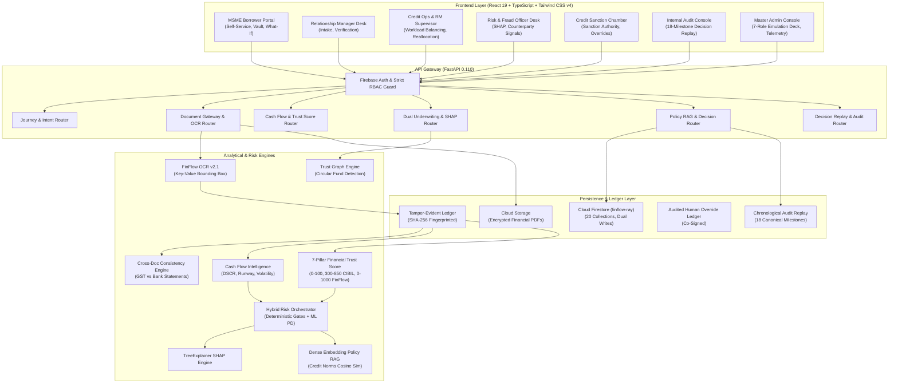

# FinFlow AI — Enterprise Intelligent Financial Journey Orchestration
**Product Platform:** FinFlow AI · **Version:** 2.2.0 Enterprise · **Team RAY:** Ruturaj Bhome  
**Domain:** Commercial SME Credit Underwriting, Alternative Scoring & Governance  

[](https://fastapi.tiangolo.com)
[](https://react.dev)
[](https://www.typescriptlang.org)
[](https://tailwindcss.com)
[](https://scikit-learn.org)
[](https://shap.readthedocs.io)
[](https://firebase.google.com)
[](file:///backend/tests)

---

## 1. Problem Statement & Executive Vision

Traditional Small and Medium Enterprise (SME) credit underwriting is structurally broken:
- **Disjointed User Journeys:** Applicants submit documents into digital voids without visibility into timeline, underwriting requirements, or status, yielding massive drop-offs.
- **Manual Verification Bottlenecks:** Human loan officers manually cross-check bank statement credits against Goods & Services Tax (GST) returns and Income Tax Returns (ITR), leading to multi-week turnaround times.
- **Black-Box AI Skepticism:** Unexplainable deep models or generic LLMs hallucinate financial metrics, fail regulatory compliance audits, and cannot be cited in credit committee hearings.
- **Thin-File / New-to-Credit Exclusion:** Millions of viable MSMEs lack traditional CIBIL bureau scores and are rejected simply for lacking prior institutional loans.
- **Synthetic Fraud & Circular Fund Transfers:** Fraudulent entities deploy accommodation entries, invoice recycling, and shell company networks that slip past isolated document-level checks.
- **Audit Deficits:** Traditional loan management systems fail to cryptographically link raw customer evidence to underwriting feature calculations and final sanction letters.

---

## 2. The FinFlow AI Solution

**FinFlow AI** unifies the entire commercial lending lifecycle into one continuous, intelligent, and explainable product:

1. **Guided Intent & Journey Orchestration:** Conversational and structured intent ingestion with an append-only canonical state machine (`INTENT_CAPTURE` $\rightarrow$ `EVIDENCE_COLLECTION` $\rightarrow$ `VERIFICATION` $\rightarrow$ `RISK_ASSESSMENT` $\rightarrow$ `EXPLAINABLE_DECISION` $\rightarrow$ `SANCTION_AND_DISBURSAL` / `HUMAN_REVIEW`).
2. **Cryptographic Evidence Vault:** Optical Character Recognition (FinFlow OCR v2.1) extracts key financial fields with pixel-level bounding boxes and immutable SHA-256 source document hashes.
3. **Deterministic Reconciliation & Cash Flow Engine:** Automated cross-triangulation between GST returns and banking statements with sub-5% variance verification, Debt Service Coverage Ratio (DSCR) calculations, and operating cash-flow volatility analysis.
4. **7-Pillar Alternative Financial Trust Score:** A deterministic, explainable $0-100$ score ($300-850$ CIBIL equivalent, $0-1000$ FinFlow index) tailored for thin-file MSMEs.
5. **Dual-Engine Underwriting (Rules + ML):** Authoritative hard policy gates (DSCR $\ge 1.25\text{x}$, Vintage $\ge 24\text{m}$, Bounces $\le 2$) combined with a calibrated gradient-boosted default model.
6. **White-Box Explainability:** TreeExplainer SHAP marginal feature contributions paired with Dense Vector Policy RAG citations to institutional credit norms.
7. **Interactive What-If Simulation:** Borrowers and underwriters simulate revenue stress-tests, buffer-day shifts, and collateral additions to view dynamic credit term impacts without mutating base records.
8. **Institutional Governance & Separation of Duties:** Visually and programmatically enforces boundaries across `CUSTOMER`, `RM`, `RM_SUPERVISOR`, `RISK_OFFICER`, `RISK_MANAGER`, `CREDIT_APPROVER`, and `AUDIT_OFFICER`.
9. **Master System Administrator Console:** 1-Click 7-Role Emulation Deck allowing judges and administrators to experience all roles seamlessly from an administrative hub.
10. **Cryptographic Decision Replay:** 18 canonical chronological milestones logged to an immutable append-only ledger for instant regulatory audit playback.

---

## 3. High-Level Architecture



---

## 4. Alternative Financial Trust Score (7-Pillar Model)

Adapted from the FT-03 alternative credit assessment engine, FinFlow AI computes an explainable, metric-backed score:

$$\text{Trust Score}_{0-100} = \sum_{k=1}^{7} \left( \text{SubScore}_k \times W_k \right)$$

$$\text{CIBIL Scale (300-850)} = \max\left(300, \, \min\left(850, \, 300 + \lfloor 5.5 \times \text{Trust Score}_{0-100} \rfloor - P_{\text{fraud}}\right)\right)$$

$$\text{FinFlow Platform Index (0-1000)} = \text{Trust Score}_{0-100} \times 10$$

### Normative Weights Breakdown:
- **Financial Stability ($25\%$):** Operating longevity, transaction depth, baseline monthly revenue scale.
- **Cash Flow Health ($20\%$):** Net monthly surplus magnitude, positive cash-flow months ratio, volatility penalty.
- **Revenue Consistency ($15\%$):** Normalized revenue stability index ($1.0 - \text{CV}$).
- **Repayment Capacity ($15\%$):** Operating surplus margin buffer for debt servicing ($\text{Net Cash Flow} / \text{Revenue}$).
- **Expense Discipline ($10\%$):** Operating Expense Ratio ($\text{Expenses} / \text{Revenue}$) benchmark alignment ($<65\%$).
- **Transaction Behaviour ($10\%$):** Digital banking velocity ($\text{tx/month}$), ticket size realism, bilateral flow mix.
- **Fraud / Risk Signals ($5\%$):** Inverted anomaly detection alert rate ($0\%$ alerts = $98$ points).

*Detailed mathematical derivations and worked examples available in [FINANCIAL_TRUST_SCORE_FORMULA.md](file:///FINANCIAL_TRUST_SCORE_FORMULA.md).*

---

## 5. Institutional 7-Role Emulation Deck & Credentials

FinFlow AI implements institutional Separation of Duties (SoD). The Master Administrator (`bhomeruturaj@gmail.com`) can seamlessly launch and inspect any role via the **7-Role Emulation Deck** on the Admin Console:

| Role Identifier | Persona Name | Institutional Role | Demonstrable Workflow |
|---|---|---|---|
| `CUSTOMER` | Priya Sharma | MSME Borrower (Sharma Textiles) | Loan intake, document vault upload, transparent sanction tracking, What-If simulator. |
| `RM` | Rohan Mehta | Relationship Manager | Commercial SME deal pipeline, pre-underwriting verification dispatch, KYC gathering. |
| `RM_SUPERVISOR`| Vikram Malhotra | Credit Operations Manager | Command & load balancing, RM caseload & exception reallocation, SLA monitoring. |
| `RISK_OFFICER` | Ananya Iyer | Fraud & Risk Officer | 5-pillar credit radar, GST vs Bank statement forensics, anomaly signal resolution. |
| `RISK_MANAGER` | Meera Krishnan | Supervisory Risk Head | High-exposure review, risk policy exception escalations, sensitivity bounds check. |
| `CREDIT_APPROVER`| Rajesh Singhania| Credit Committee Chair | **Exclusive Sanction Power:** Formal credit sanction, interest rate override, approval chamber. |
| `AUDIT_OFFICER` | Sunita Rao | Director of Internal Audit | 18-milestone chronological decision replay, cryptographic hash inspection, audit findings. |
| `SYS_ADMIN` | Ruturaj Bhome | Technical Custodian | System telemetry, API health, 1-Click Role Emulation Deck. *Zero credit sanction power.* |

---

## 6. Quickstart & Local Setup

### Prerequisites
- Python 3.11+ (Python 3.11–3.14 supported)
- Node.js 18+ and npm 9+
- Git

### 1. Repository Setup
```bash
git clone https://github.com/RutuRaj-1/Mindcraft_Team_RAY_Fintech.git
cd Mindcraft_RAY_Fintech
```

### 2. Backend Setup
```bash
# Create and activate python virtual environment (recommended)
python -m venv .venv
source .venv/bin/activate  # On Windows: .venv\Scripts\activate

# Install backend dependencies
pip install -r backend/requirements.txt

# Start backend server
python -m uvicorn backend.main:app --host 0.0.0.0 --port 8000 --reload
```
*Backend runs at `http://localhost:8000`. Interactive OpenAPI documentation available at `http://localhost:8000/docs`.*

### 3. Frontend Setup
```bash
# In a separate terminal
cd frontend
npm install
npm run dev
```
*Frontend runs at `http://localhost:5173` (or `5174`).*

---

## 7. Cloud Persistence & Environment Variables

### Backend Configuration (`backend/.env` or defaults)
```ini
APP_NAME=FinFlow-AI
ENVIRONMENT=development
PORT=8000
DEBUG=True

ALLOWED_ORIGINS=http://localhost:5173,http://localhost:5174,http://127.0.0.1:5173,http://127.0.0.1:5174
SECRET_KEY=finflow-super-secure-production-key-for-jwt-and-signing

# Firebase Cloud Firestore Project
FIREBASE_PROJECT_ID=finflow-ray
FIREBASE_STORAGE_BUCKET=finflow-ray.firebasestorage.app
USE_IN_MEMORY_FIRESTORE=False
```

### Frontend Configuration (`frontend/.env`)
```ini
VITE_API_BASE_URL=http://localhost:8000/api/v1
VITE_FIREBASE_PROJECT_ID=finflow-ray
VITE_FIREBASE_AUTH_DOMAIN=finflow-ray.firebaseapp.com
VITE_FIREBASE_STORAGE_BUCKET=finflow-ray.firebasestorage.app
```

---

## 8. Verification & Automated Testing

FinFlow AI includes an exhaustive test suite covering all 20 repositories, rule evaluations, ML models, SHAP explanations, RBAC security gates, and the adapted Financial Trust Score engine:

```bash
# Run complete test suite (212 passing tests)
python -m pytest

# Run Financial Trust Score engine tests
python -m pytest backend/tests/test_financial_trust_score.py

# Run RBAC Separation of Duties tests
python -m pytest backend/tests/test_rbac_end_to_end.py

# Run Acceptance Criteria TC-01 through TC-11
python -m pytest backend/tests/test_final_acceptance_tcs.py

# Run frontend build & TypeScript check
cd frontend
npm run build
```

---

## 9. Comprehensive Documentation Index

- [PROJECT.md](file:///PROJECT.md) — Master End-to-End System Workflow & Technical Architecture Blueprint.
- [FINANCIAL_TRUST_SCORE_FORMULA.md](file:///FINANCIAL_TRUST_SCORE_FORMULA.md) — Complete Mathematical Foundations, Formulas & Worked Examples.
- [ARCHITECTURE.md](file:///ARCHITECTURE.md) — Core Architectural Principles & 7 Bounded Services.
- [AI_PIPELINE.md](file:///AI_PIPELINE.md) — 4-Stage Underwriting Intelligence (Gates, ML, SHAP, RAG).
- [API.md](file:///API.md) — REST API Specification & Endpoint Contracts.
- [FIRESTORE_SCHEMA.md](file:///FIRESTORE_SCHEMA.md) — 20-Collection Firestore Data Model & Indexes.
- [RBAC.md](file:///RBAC.md) — Institutional Access Control & Separation of Duties Matrix.
- [DEMO_GUIDE.md](file:///DEMO_GUIDE.md) & [DEMO_CREDENTIALS.md](file:///DEMO_CREDENTIALS.md) — Step-by-Step Presentation Walkthrough for Hackathon Judges.

---

## License & Team Attribution
**MindCraft FinTech Hackathon 2026** · **Team RAY** · **Lead Developer:** Ruturaj Bhome  
Licensed under the **MIT License**.
